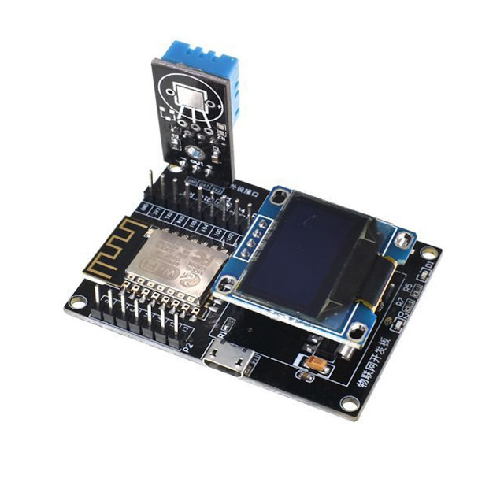
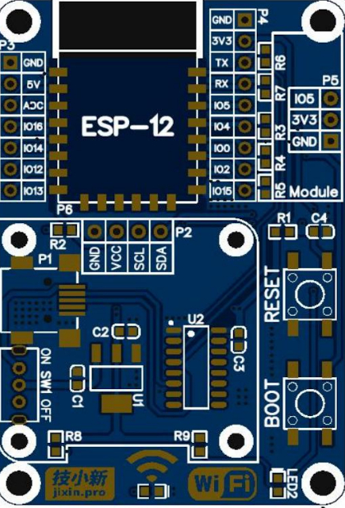
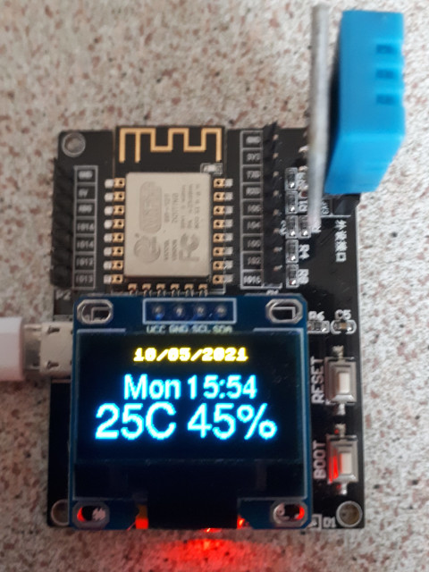

# Geekcreit® ESP8266 IoT Development Board + DHT11 Temperature and Humidity Sensor + Yellow Blue OLED Display

[Buy from Bangood](https://www.banggood.com/Geekcreit-ESP8266-IoT-Development-Board-DHT11-Temperature-and-Humidity-Yellow-Blue-OLED-Display-SDK-Programming-Wifi-Module-p-1471313.html?rmmds=myorder&cur_warehouse=CN)

[Geekcreit ESP8266 IoT Dev Board Schematic](resources/geekcreit_esp8266_iot_dev_board_schematic.pdf)

[ESP8266 12F manual](resources/ESP-12F.pdf)



## IoT Dev Board Parts
The Geekcreit® ESP8266 IoT Development Board consist of :
* IoT main board with ESP8266 Wifi module (ESP-12F)
* 3 pin interface for DHT11 Temperature and Humidity sensor (included)
* 4 pin I2C interface for 0.96" Yellow/Blue OLED module (included)
* micro USB interface for power and communication

## IoT Dev Board Pin Layout 


Header|No|Pin|Description
:--:|:--:|:--:|-----------
|||**Micro USB**
P1|1|VCC|VCC 5V -> *LED1 power (red)*
P1|2|D-|USB Data -
P1|3|D+|USB Data +
P1|4|ID|USB ID (NC)
P1|5|GND|Ground
|||**OLED**
|P2|1|3V3|VCC 3.3V
|P2|2|GND|Ground
|P2|3|SCL|GPIO 14 -> *I2C clock pin OLED*
|P2|4|SDA|GPIO 2 -> *I2C data pin OLED*
|||**ESP8266 left** 
P3|1|GND|Ground
P3|2|5V|VCC 5V
P3|3|ADC|Analog to digital convertor
P3|4|IO16|GPIO 16
P3|5|IO14|GPIO 14 -> *I2C clock pin OLED*
P3|6|IO12|GPIO 12
P3|7|IO13|GPIO 13
|||**ESP8266 right**
P4|1|GND|Ground
P4|2|3V3|VCC 3.3V
P4|3|TXD|UART0_TXD, GPIO1
P4|4|RXD|UART0_RXD, GPIO3
P4|5|IO5|GPIO 5 -> *DHT11 data pin*
P4|6|IO4|GPIO 4 -> *LED2 signal (green)*
P4|7|IO0|GPIO 0
P4|8|IO2|GPIO 2 -> *I2C data pin OLED*
P4|9|IO15|GPIO 15
|||**DHT11**
P5|1|GND|Ground
P5|2|DAT|GPIO 5 -> *DHT11 data pin*
P5|3|3V3|VCC 3.3V

## IoT Dev Board Modes
The dev board can work in these modes :
Mode|GPIO 0|GPIO 2|GPIO 15
:--:|:--:|:--:|-----------
Program operation|1|1|0
Serial download|0|1|0

## IoT Dev Board Sourcecode

The code will show the following information on the OLED display:
- Day of week
- Date
- Time
- Temperature (°C)
- Humidity (%)

### Micropython

#### Preparation
- Download the [latest Micropython firmware](https://micropython.org/resources/firmware/esp8266-20191220-v1.12.bin)
- [Install](http://docs.micropython.org/en/latest/esp8266/tutorial/intro.html#deploying-the-firmware) the firmware onto the IoT Dev Board 

#### Sourcecode
The [sourcecode](sourcecode/micropython/esp8266_dht11_oled.py) consists of the following functions:
- **updateRTC** : The internal RTC of the ESP8266 is accurate enough to be used to get the date and time to be displayed. As the module contains no battery, the current date and time is adjusted by calling an NTP server on the Internet via Wifi. This process is executed every 6 hours to adjust the RTC.
- **measureDHT** : The DHT11 temperature and humidity is measured every 5 seconds.
- **refreshOLED** : The OLED display with day of week, date, time, temperature and humidity is refreshed every second.

*Due to the different intervals of these 3 functions of the program, an asynchronous approch was used when coding (module asyncio)*


These are the modules that were used:
Module|Description|Installation
:-----:|:-------------:|-------------
machine|hardware related functions|(builtin)
network|network configuration|(builtin)
utime|time related functions|(builtin)
ntptime|synchronize RTC with ntp|(builtin)
dht|functions for DHTxx sensors|(builtin)
ssd1306|functions for oled displays|import upip; upip.install('micropython-ssd1306')
uasyncio|asynchronous I/O scheduler|import upip; upip.install('micropython-uasyncio'); upip.install('micropython-uasyncio.synchro'); upip.install('micropython-uasyncio.queues')


Upload the sourcecode as ```boot.py``` to the IoT Dev Board and press the reset button. The following is shown on the OLED display:



### Arduino

#### Preparation
- Download the [latest Arduino IDE](https://www.arduino.cc/en/Main/Software) for you OS and install it.
- Start the Arduino IDE, go to File > Preferences and enter **http://arduino.esp8266.com/stable/package_esp8266com_index.json** into the “Additional Boards Manager URLs” field
- Go to Tools > Board > Boards Manager…
- Search for **ESP8266** and press install button for the **ESP8266 by ESP8266 Community** boards.

#### Sourcecode
The code uses the following libraries:
- wire
- ...

